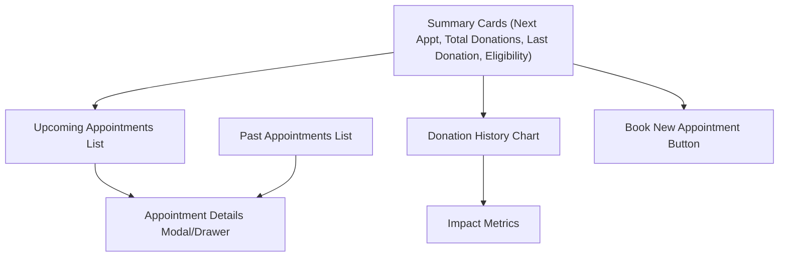

# Donor Appointments Dashboard Enhancement Plan

## Overview

This document outlines a step-by-step implementation checklist to enhance the `/portal/donors/donor-appointments` page with a modern, informative, and user-friendly dashboard. It also includes a sample wireframe for visual reference.

---

## Step-by-Step Implementation Checklist

### 1. Design & Planning

-   [ ] Create wireframes/mockups for the new dashboard layout, including:
    -   Summary cards (Next Appointment, Total Donations, Last Donation, Eligibility)
    -   Upcoming and Past Appointments lists
    -   Analytics chart and impact metrics
    -   Appointment Details modal/drawer
-   [ ] Review with stakeholders for feedback and approval.

### 2. Refactor Page Structure

-   [ ] Break down the page into reusable components:
    -   `SummaryCards`
    -   `UpcomingAppointmentsList`
    -   `PastAppointmentsList`
    -   `AnalyticsChart`
    -   `ImpactMetrics`
    -   `AppointmentDetailModal`
-   [ ] Organize components for maintainability and scalability.

### 3. Data Aggregation & Server Actions

-   [ ] Update or create server actions to provide:
    -   Summary statistics (next appointment, total donations, last donation, eligibility countdown)
    -   Upcoming and past appointments data
    -   Donation history for analytics
    -   Impact metrics (lives saved, milestones)
-   [ ] Ensure all data fetching uses server actions (not API routes) as per project standards.

### 4. Build UI Components

-   [ ] Implement summary cards with icons and color-coded statuses.
-   [ ] Build upcoming and past appointments lists with action buttons (View, Reschedule, Cancel).
-   [ ] Integrate a chart library (e.g., recharts, chart.js) for donation history visualization.
-   [ ] Display impact metrics and badges for donor milestones.
-   [ ] Create Appointment Details modal/drawer with full info, preparation tips, calendar integration, and QR code (if supported).

### 5. Add Interactivity & Actions

-   [ ] Implement handlers for rescheduling, cancelling, and viewing appointment details.
-   [ ] Add prominent 'Book New Appointment' button.
-   [ ] Enable export/download of appointment history (PDF/CSV).
-   [ ] Provide quick contact/support link.

### 6. Enhance UX & Accessibility

-   [ ] Use `<LoadingModal isLoading={isPending}>Processing...</LoadingModal>` for all async actions.
-   [ ] Add friendly empty states and error handling.
-   [ ] Ensure responsive design for all devices.
-   [ ] Improve accessibility (color contrast, keyboard navigation, ARIA labels).
-   [ ] Show notifications/toasts for user actions.

### 7. Testing & Feedback

-   [ ] Test all features with real and mock data.
-   [ ] Gather user feedback and iterate on design and functionality.
-   [ ] Finalize and deploy enhancements.

---

## Sample Dashboard Wireframe

---

## Notes

-   Prioritize clarity, ease of use, and motivation for donors.
-   Use cards, charts, and modals for a modern dashboard feel.
-   Follow project conventions for server actions and loading states.
